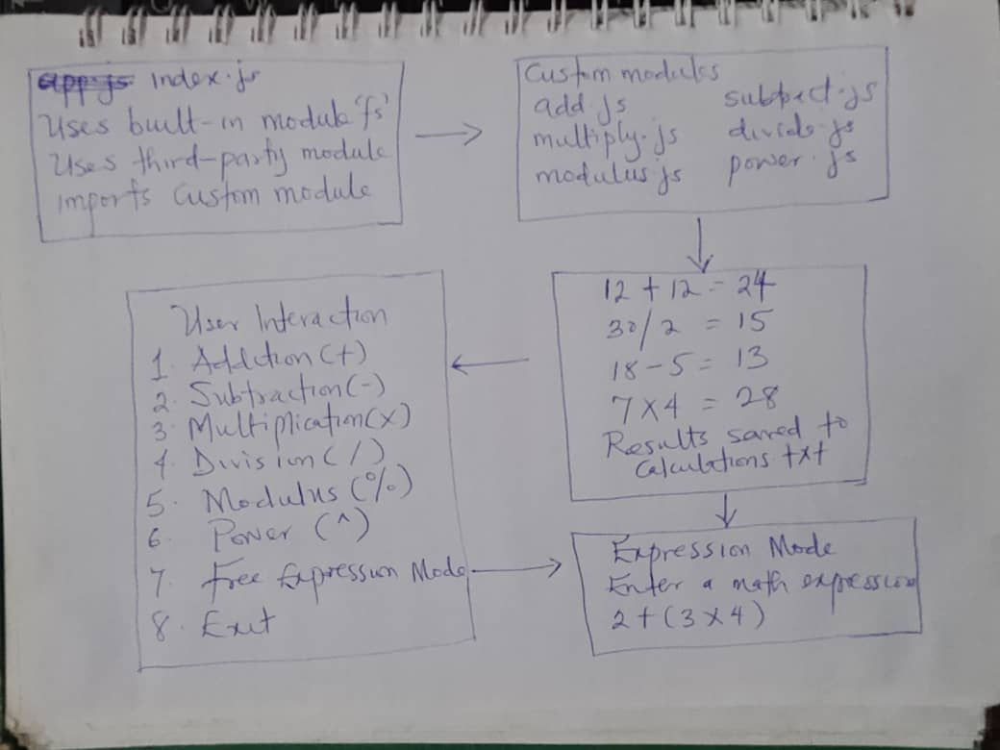

# 📘 Node.js Calculator Application

This is a simple **Node.js Calculator App** that demonstrates the use of:

* **Built-in Node.js modules** (`fs`, `readline`)
* **Third-party module** (`chalk` for colorful output)
* **Custom modules** (addition, subtraction, multiplication, division, modulus, power)

It includes an **interactive text-based menu** that allows users to perform different calculations directly in the terminal.

---

## ✨ Features

* ✅ Addition
* ✅ Subtraction
* ✅ Multiplication
* ✅ Division (with divide-by-zero error handling)
* ✅ Modulus (remainder)
* ✅ Power (exponentiation)
* ✅ Results are saved to a `calculations.txt` file
* ✅ Interactive CLI menu using Node.js `readline`
* ✅ Colorful output using `chalk`
* ✅ Displays **registration number** at startup

---

## 📂 Project Structure

```
calculator-app/
│
├── app.js          # Main entry point (interactive menu)
├── add.js          # Custom module 1
├── subtract.js     # Custom module 2
├── multiply.js     # Custom module 3
├── divide.js       # Custom module 4
├── modulus.js      # Custom module 5
├── power.js        # Custom module 6
├── package.json
└── calculations.txt # Created dynamically to store results
└── docs/
    └── rough-sketch.jpg # Rough ideation sketch
```

## 📝 Rough Ideation Sketch

Below is the rough sketch that outlines the design and flow of the calculator application:




---

## ⚡ Installation

1. Clone this repository:

   ```bash
   
   cd nodejs-calculator-app
   ```

2. Install dependencies:

   ```bash
   npm install
   ```

3. Run the app:

   ```bash
   npm start
   ```

   or

   ```bash
   node index.js
   ```

---

## 🖥️ Example Usage

```
Registration Number: BD/2025/TC3/008

=== WELCOME TO NODE.JS CALCULATOR ===

Choose an operation:
1. Addition (+)
2. Subtraction (-)
3. Multiplication (*)
4. Division (/)
5. Modulus (%)
6. Power (^)
7. Exit

Enter your choice (1-7): 3
Enter first number: 8
Enter second number: 7

✖️  8 * 7 = 56
```

---

## 🛠️ Technologies Used

* **Node.js** (ES Module format)
* **chalk** (third-party npm module)
* **fs** and **readline** (built-in modules)

---

## 📝 Notes

* Ensure you are running **Node.js v14+** (supports ES modules).
* Results of each calculation are appended to `calculations.txt`.
* Exit the app anytime by selecting **option 7**.

---

## 📜 License

This project is for **educational purposes**. You are free to use and modify it.
